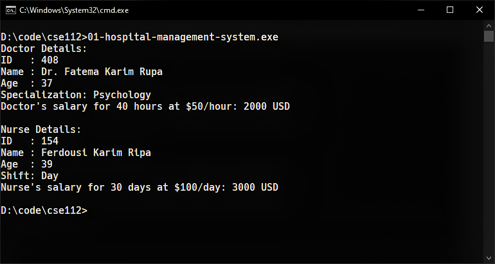
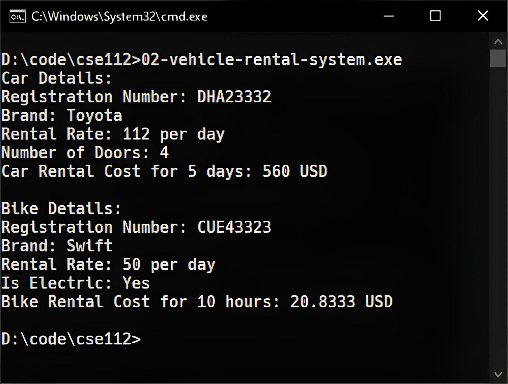

::: {#cover.border}

<section>
	
</section>
<section>
	<p class="h1 w800 underline text-upr">Assignment</p>
	<table class="compact borderless table-large table-upr padless" style="width: 5.1in">
		<tr>
			<th>Course Title</th>
			<th>:</th><td>Object Oriented Programming</td>
		</tr>
		<tr>
			<th>Course Code</th>
			<th>:</th><td>CSE 111-112</td>
		</tr>
		<tr>
			<th>Assignment No.</th>
			<th>:</th><td>02</td>
		</tr>
		<tr>
			<th>Submission Date</th>
			<th>:</th><td>09-12-2024</td>
		</tr>
	</table>
</section>
<section style="--hw: 7.2rem;">
	<p class="h2 w800 text-upr">Submitted To</p>
	<table class="compact borderless table-large table-upr padless withleader">
		<tr>
			<th>Name</th>
			<td>Md. Amirul Hasan Shanto</td>
		</tr>
		<tr>
			<th>Dept. of</th>
			<td>Computer Science and Engineering (CSE)</td>
		</tr>
		<tr>
			<th></th>
			<td>Bangladesh University of Business & Technology (BUBT)</td>
		</tr>
	</table>
</section>
<section style="--hw: 7.2rem;">
	<p class="h2 w800 text-upr">Submitted By</p>
	<table class="compact borderless table-large table-upr padless withleader">
		<tr>
			<th>Name</th>
			<td>Shadman Shahriar</td>
		</tr>
		<tr>
			<th>ID No.</th>
			<td>20245103408</td>
		</tr>
		<tr>
			<th>Intake</th>
			<td>53</td>
		</tr>
		<tr>
			<th>Section</th>
			<td>9</td>
		</tr>
		<tr>
			<th>Program</th>
			<td>B.Sc. Engg. in CSE</td>
		</tr>
	</table>
</section>

:::

::: {.centered-heading}

# Object Oriented Programming

# Assignment 2

:::

## 1. Hospital Management System

You are tasked with developing a **Hospital Management System** using object-oriented programming concepts. The system must handle the details of hospital staff, including doctors and nurses. Each staff member has some common attributes, but their behaviors vary based on their role.

Using this context, implement the following requirements:

1. **Base Class**
    - Create a base class `Staff` with the following:
    - Private attributes: `id` (**integer**) and `name` (**string**).
    - Protected attributes: `age` (**integer**).
    - A public method `displayDetails()` that prints the details of the staff member.
2. **Inheritance**
    - Derive two classes, `Doctor` and `Nurse`, from the `Staff` class.
3. **Overriding**
    - Override the `displayDetails()` method in both `Doctor` and `Nurse` classes to include their specific information:
    - For **Doctor**: Add `specialization` (**string**).
    - For **Nurse**: Add `shift` (**day/night**).
4. **Overloading**
    - Implement a method `calculateSalary()` in both `Doctor` and `Nurse` classes using function overloading to calculate salary:
    - For **Doctor**: `calculateSalary(int hours, int hourlyRate)` returns `hours * hourlyRate`.
    - For **Nurse**: `calculateSalary(int days, int dailyRate)` returns `days * dailyRate`.
5. **Access Modifier Usage**
    - Ensure id and name are **only accessible within the class**.
    - Allow age to be **accessible in the derived classes**.
6. **Implementation**
    - Write a small program that creates a `Doctor` and a `Nurse` object, sets their attributes, and displays their details. Also, calculate and display their salaries.

**Ans.** Here is a C++ program that satisfies the conditions above:

```CPP
/**
 * ======================
 * Name: Shadman Shahriar
 * ID  : 20245103408
 * ======================
 */

#include <iostream>
using namespace std;

class Staff
{
private:
	int id;
	string name;

protected:
	int age;

public:
	Staff(int sid, string sname, int sage)
	{
		id = sid;
		name = sname;
		age = sage;
	}

	virtual void displayDetails()
	{
		cout << "ID   : " << id << endl;
		cout << "Name : " << name << endl;
		cout << "Age  : " << age << endl;
	}
};

class Doctor : public Staff
{
private:
	string specialization;

public:
	Doctor(int sid, string sname, int sage, string ss) : Staff(sid, sname, sage), specialization(ss) {}

	void displayDetails()
	{
		Staff::displayDetails();
		cout << "Specialization: " << specialization << endl;
	}

	int calculateSalary(int hours, int hourlyRate)
	{
		return hours * hourlyRate;
	}
};

class Nurse : public Staff
{
private:
	string shift;

public:
	Nurse(int sid, string sname, int sage, string ns) : Staff(sid, sname, sage), shift(ns) {}

	void displayDetails()
	{
		Staff::displayDetails();
		cout << "Shift: " << shift << endl;
	}

	int calculateSalary(int days, int dailyRate)
	{
		return days * dailyRate;
	}
};

int main()
{
	Doctor doctor(408, "Dr. Fatema Karim Rupa", 37, "Psychology");
	cout << "Doctor Details:" << endl;
	doctor.displayDetails();
	cout << "Doctor's salary for 40 hours at $50/hour: " << doctor.calculateSalary(40, 50) << " USD" << endl;

	cout << endl;

	Nurse nurse(154, "Ferdousi Karim Ripa", 39, "Day");
	cout << "Nurse Details:" << endl;
	nurse.displayDetails();
	cout << "Nurse's salary for 30 days at $100/day: " << nurse.calculateSalary(30, 100) << " USD" << endl;

	return 0;
}
```

**Output:** The code yields the following output in the terminal:

```diff
Doctor Details:
ID   : 408
Name : Dr. Fatema Karim Rupa
Age  : 37
Specialization: Psychology
Doctor's salary for 40 hours at $50/hour: 2000 USD

Nurse Details:
ID   : 154
Name : Ferdousi Karim Ripa
Age  : 39
Shift: Day
Nurse's salary for 30 days at $100/day: 3000 USD
```



## 2. Vehicle Rental System

You are designing a **Vehicle Rental System** for a rental company that manages different types of vehicles (e.g., cars and bikes). Each vehicle has some common attributes, but their behaviors differ depending on the type of vehicle.

Implement the following requirements:

1. **Base Class**
   Create a base class Vehicle with:
    - Private attributes: `registrationNumber` (**string**) and `brand` (**string**).
    - Protected attributes: `rentalRate` (**float**).
    - A public method `displayDetails()` to show common details of the vehicle.
2. **Inheritance**
    - Derive two classes, `Car` and `Bike`, from the `Vehicle` class.
3. **Overriding**
   Override the `displayDetails()` method in both derived classes to include specific attributes:
    - For **Car**: Add `numberOfDoors` (**integer**).
    - For **Bike**: Add `isElectric` (**boolean**).
4. **Overloading**
   Implement a method calculateRentalCost() in both derived classes using function overloading:
    - For **Car**: Overload it to accept days (**integer**) and return the rental cost as `days * rentalRate`.
    - For **Bike**: Overload it to accept hours (**integer**) and return the rental cost as `hours * (rentalRate / 24)`.
5. **Access Modifier Usage**
    - Ensure `registrationNumber` and `brand` are **only accessible within the base class**.
    - Allow rentalRate to be **accessible in the derived classes**.
6. **Implementation**
    - Create instances of `Car` and `Bike` in the main function, set their attributes, display their details, and calculate their rental costs.

**Ans.** Here is a C++ program that satisfies the conditions above:

```CPP
/**
 * ======================
 * Name: Shadman Shahriar
 * ID  : 20245103408
 * ======================
 */

#include <iostream>
using namespace std;

class Vehicle
{
private:
	string registrationNumber;
	string brand;

protected:
	float rentalRate;

public:
	Vehicle(string rn, string br, float rate) : registrationNumber(rn), brand(br), rentalRate(rate) {}

	virtual void displayDetails()
	{
		cout << "Registration Number: " << registrationNumber << endl;
		cout << "Brand: " << brand << endl;
		cout << "Rental Rate: " << rentalRate << " per day" << endl;
	}
};

class Car : public Vehicle
{
private:
	int numberOfDoors;

public:
	Car(string regNum, string br, float rate, int doors) : Vehicle(regNum, br, rate), numberOfDoors(doors) {}

	void displayDetails()
	{
		Vehicle::displayDetails();
		cout << "Number of Doors: " << numberOfDoors << endl;
	}

	float calculateRentalCost(int days)
	{
		return days * rentalRate;
	}
};

class Bike : public Vehicle
{
private:
	bool isElectric;

public:
	Bike(string regNum, string br, float rate, bool electric) : Vehicle(regNum, br, rate), isElectric(electric) {}

	void displayDetails()
	{
		Vehicle::displayDetails();
		cout << "Is Electric: " << (isElectric ? "Yes" : "No") << endl;
	}

	float calculateRentalCost(int hours)
	{
		return hours * (rentalRate / 24);
	}
};

int main()
{
	Car car("DHA23332", "Toyota", 112.0, 4);
	cout << "Car Details:" << endl;
	car.displayDetails();
	cout << "Car Rental Cost for 5 days: " << car.calculateRentalCost(5) << " USD" << endl << endl;
	Bike bike("CUE43323", "Swift", 50.0, true);
	cout << "Bike Details:" << endl;
	bike.displayDetails();
	cout << "Bike Rental Cost for 10 hours: " << bike.calculateRentalCost(10) << " USD" << endl;
	return 0;
}
```

**Output:** The code yields the following output in the terminal:

```diff
Car Details:
Registration Number: DHA23332
Brand: Toyota
Rental Rate: 112 per day
Number of Doors: 4
Car Rental Cost for 5 days: 560 USD

Bike Details:
Registration Number: CUE43323
Brand: Swift
Rental Rate: 50 per day
Is Electric: Yes
Bike Rental Cost for 10 hours: 20.8333 USD
```


