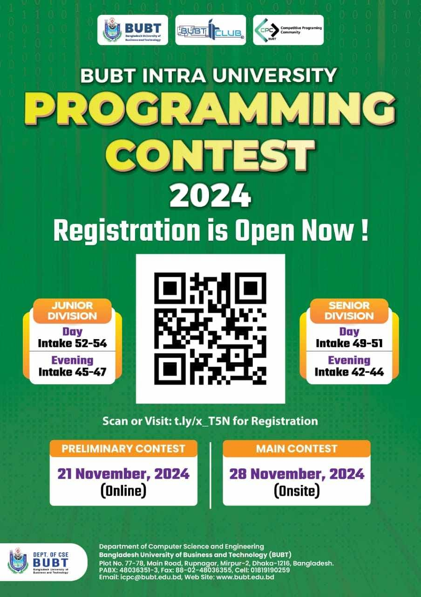
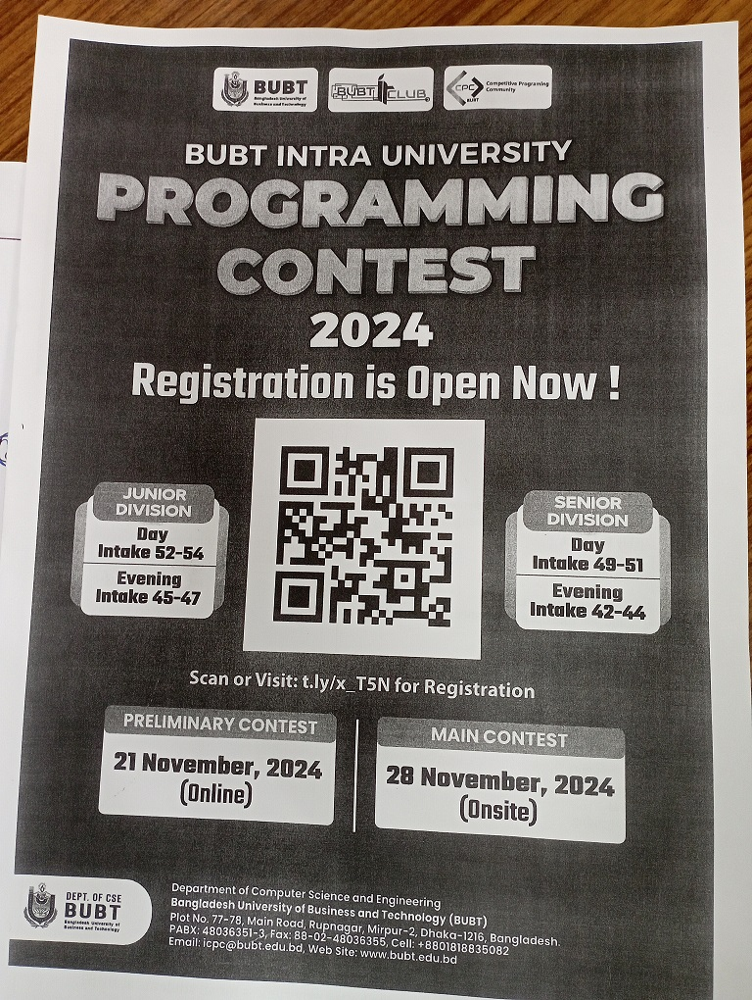

# BIUPC 2.0 2024

This folder contains the programming contest submissions from my second semester at university.

-   [20 Nov 2024: **Preliminary Mock**](https://github.com/ShadowShahriar/cse112/tree/main/contest-01/01-preliminary-mock)
-   [21 Nov 2024: **Preliminary** 📌](https://github.com/ShadowShahriar/cse112/tree/main/contest-01/02-preliminary)
-   [21 Nov 2024: **Practice**](https://github.com/ShadowShahriar/cse112/tree/main/contest-01/03-practice)
-   [27 Nov 2024: **Onsite Mock**](https://github.com/ShadowShahriar/cse112/tree/main/contest-01/04-onsite-mock)
-   [28 Nov 2024: **Onsite** 📌](https://github.com/ShadowShahriar/cse112/tree/main/contest-01/05-onsite)

 

