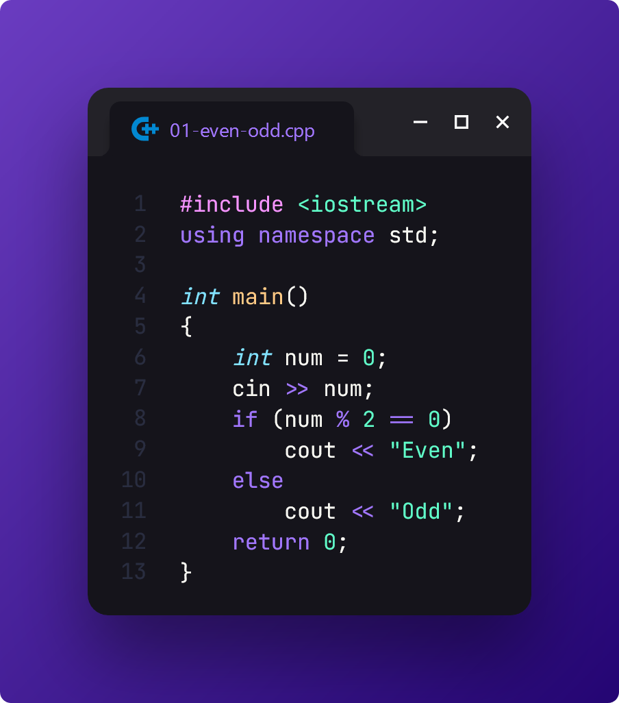
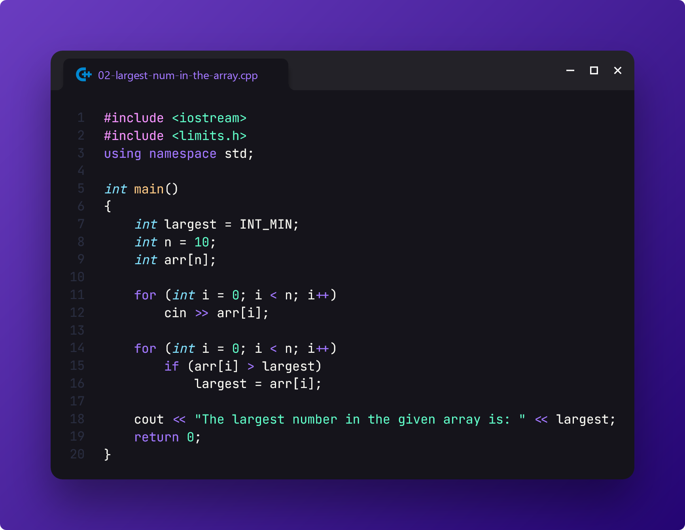
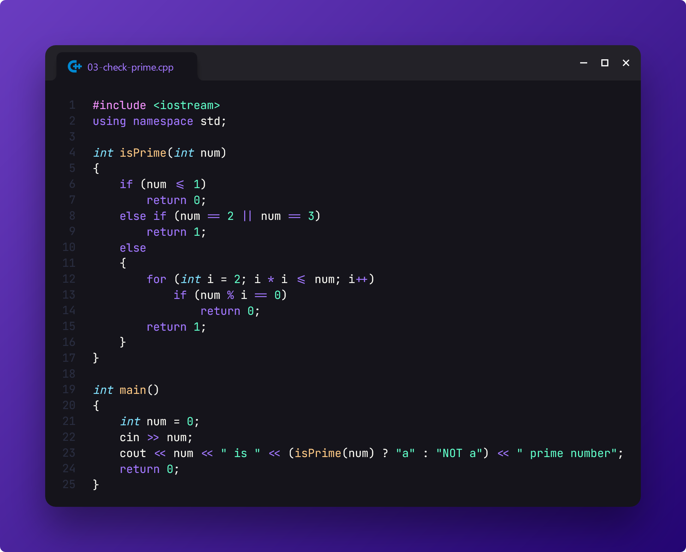
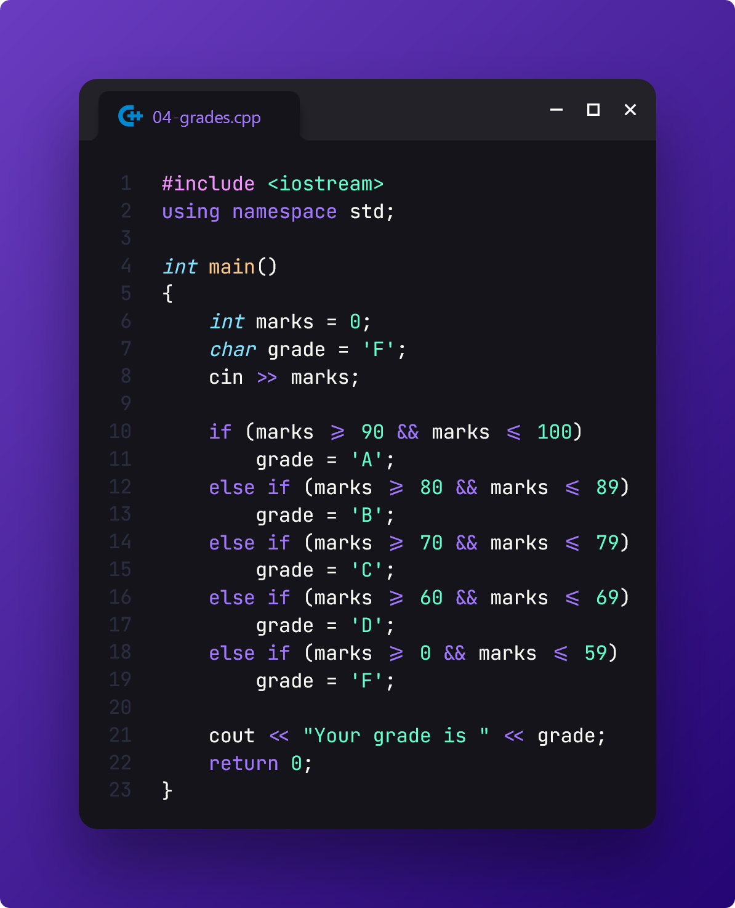
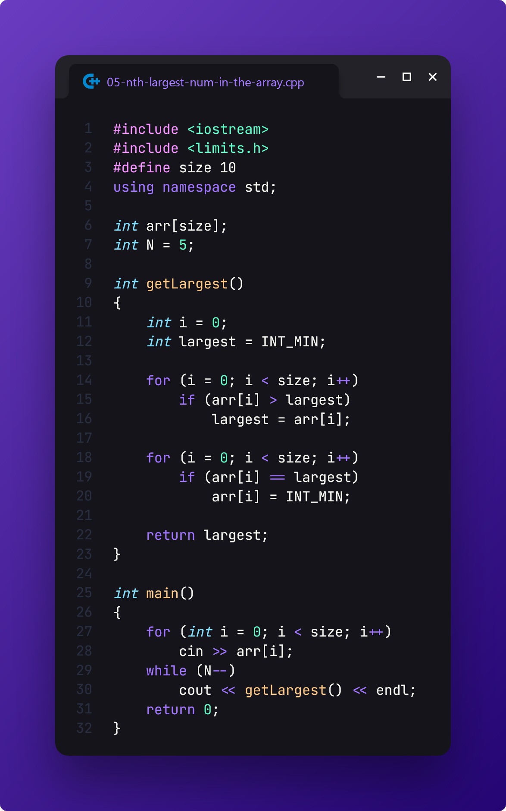
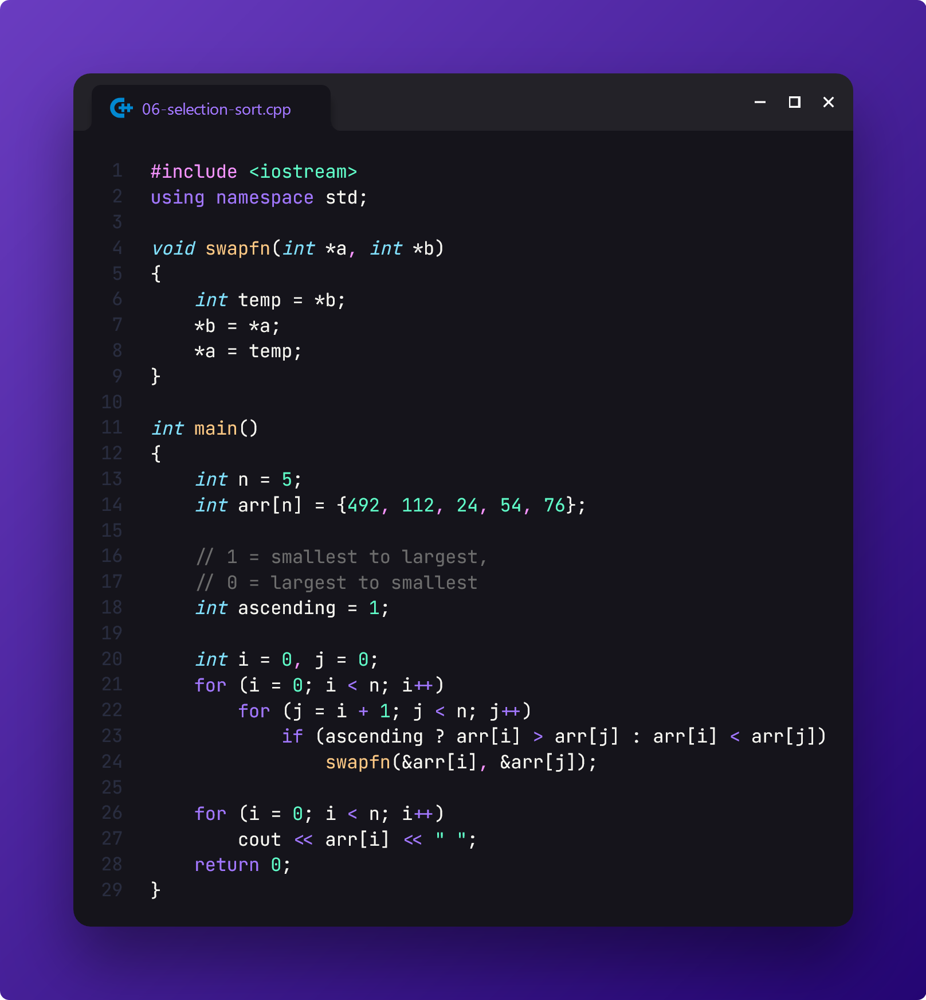

# Lab Evaluation

> This is my submission for the first **OOP Lab Evaluation** held on **July 8, 2024** by our CSE lecturer, **MHO**.

[📄 **Question Paper**](./tasks.pdf)

## Task 1: Verify if a number is Even or Odd

## Task 2: Determine the largest number from an Array

## Task 3: Verify if a given number is a Prime number

## Task 4: Assign grades to a given number

## Extra: Find the N-th largest number from an Array

## Extra: Selection Sort

