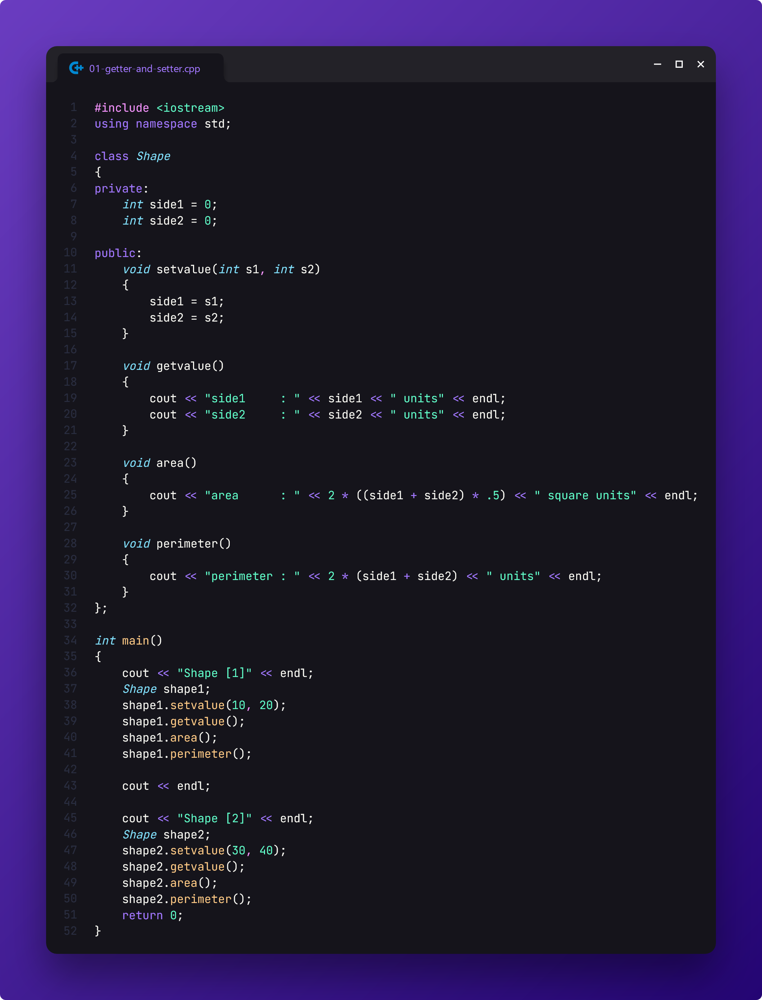
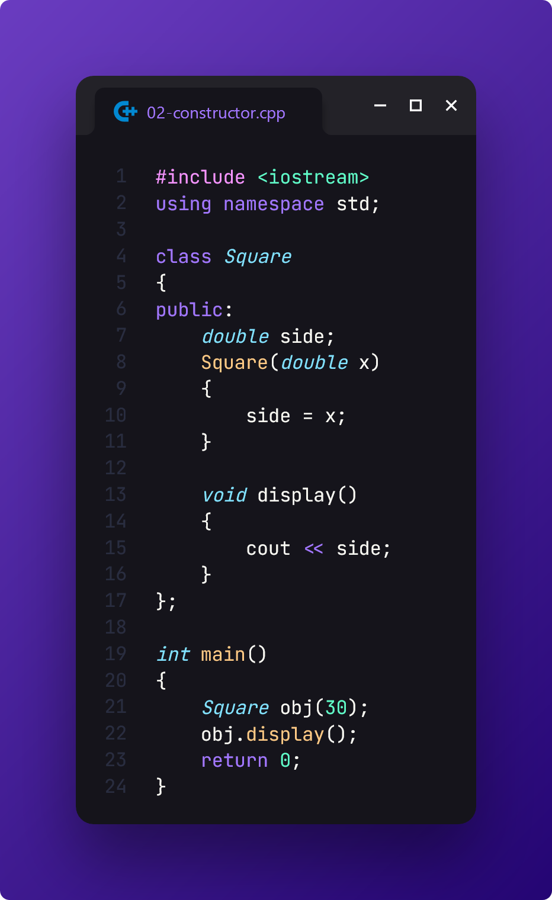
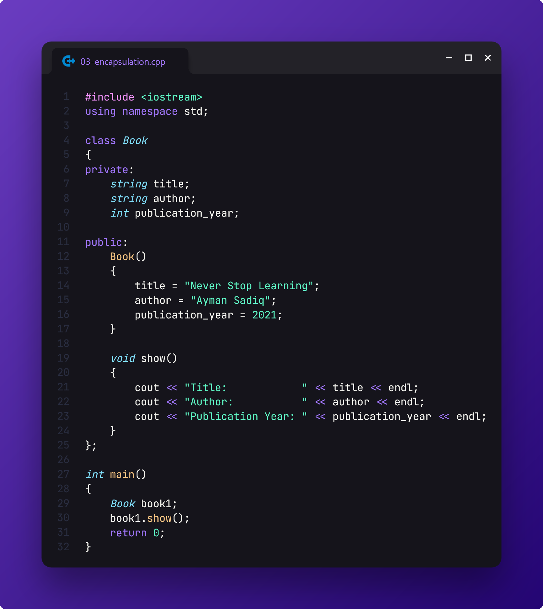
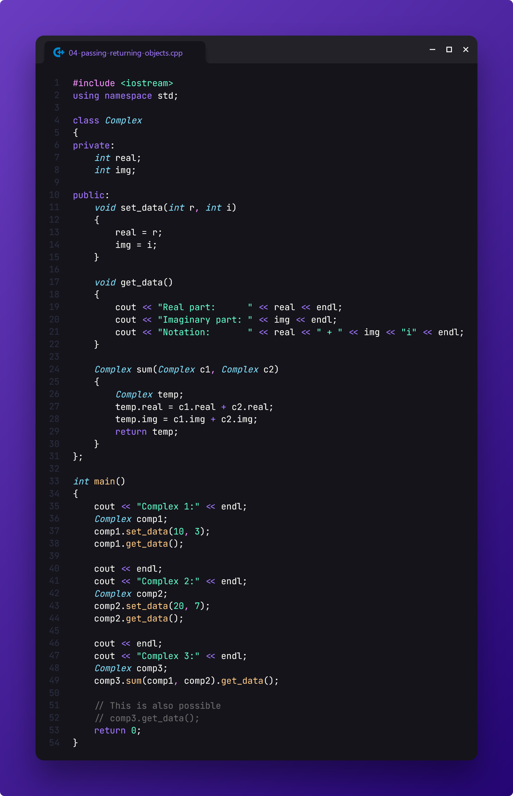

# Lab Evaluation

> This is my submission for the **OOP Lab Evaluation** held on **July 15, 2024** by our CSE lecturer, **MHO**.

[📄 **Question Paper**](./tasks.pdf)

## Task 1

-   Build a class named `Shape` with two **private** attributes, `side1` and `side2`, along with methods `area` and `perimeter`. Implement setter and display functions to access these attributes and display their values.

-   Create two instances of `Shape`, setting the values `side1 = 10` and `side2 = 20` for the **first instance**, and `side1 = 30` and `side2 = 40` for the **second instance**.

-   Formula for area:
    ```
    area = 2 * ((side1 + side2) / 2)
    ```
-   Formula for perimeter:
    ```
    perimeter = 2 * side1 + 2 * side2
    ```



## Task 2

-   Create a class named `Square` having data member `side` as **double** type.

-   Implement a member function `display` that is used to show the values of `side` and a **parameterized constructor** is used to initialize the value of `side` for the **first object**.

-   Create one object `ob1(30)` and show the value of `side` for the object.



## Task 3

-   Design a class named `Book` to encapsulate information about a book, such as `title`, `author`, and `publication year`.

-   Implement a **non-parameterized constructor** to set default values for the attributes.

-   Provide an example of creating objects of the Book class, accessing their attributes.



## Task 4

-   Define a class called `Complex` to represent **complex numbers**. It has **private** member variables `real` and `img` to store the real and imaginary parts of the number, respectively.

-   Implement **public** member functions `set_data` and `get_data` to set and display the values of the complex number.

-   Declare a member function named `sum` that <ins>takes two Complex objects as **parameters**</ins> and <ins>**returns** a new Complex object</ins> that represents the sum of the two complex numbers.

-   Inside the `sum` function, create a new Complex object `temp` and **assign** the sum of the real and imaginary parts of the two input complex numbers to the <ins>corresponding members of `temp`</ins>.

-   In the **main function**, create three Complex objects `c1`, `c2`, and `c3`. Set the data for `c1` and `c2` using the `set_data` function.

-   Call the `sum` function, passing `c1` and `c2` as **arguments**, and **assign** the <ins>returned object</ins> to `c3`.

-   Display the sum of the complex numbers using the `get_data` function.


