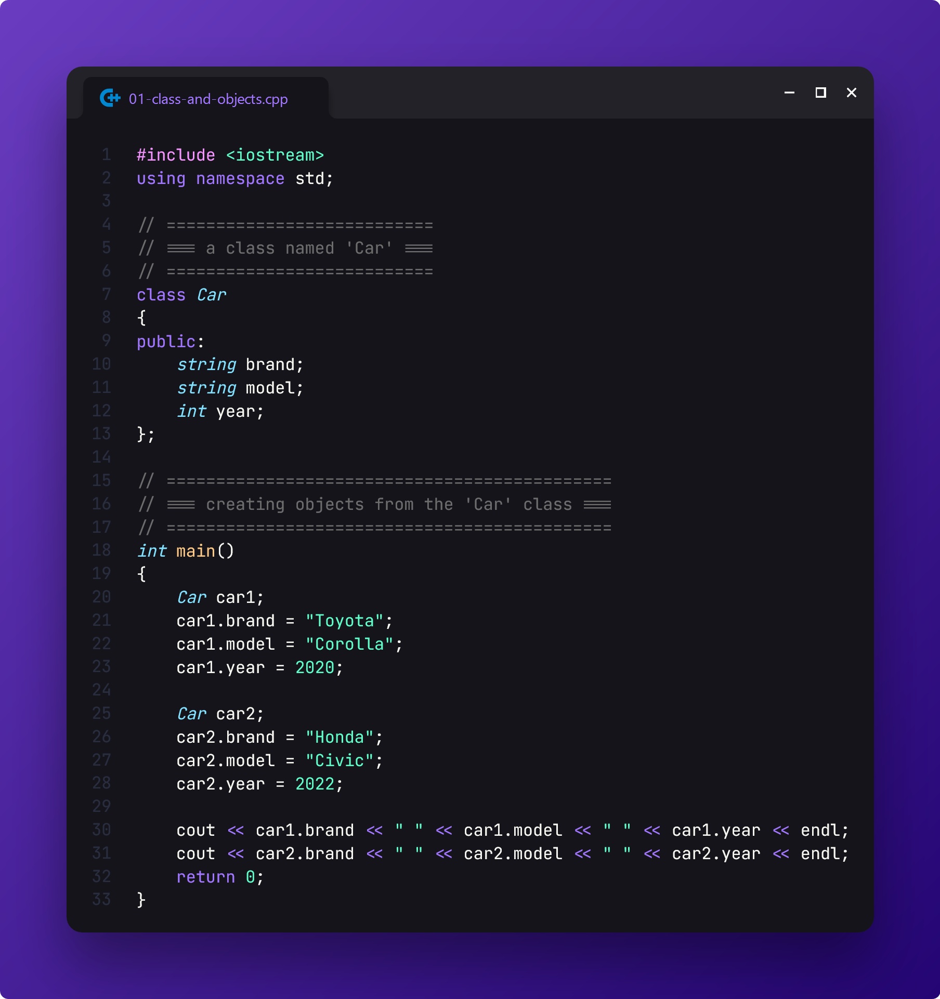
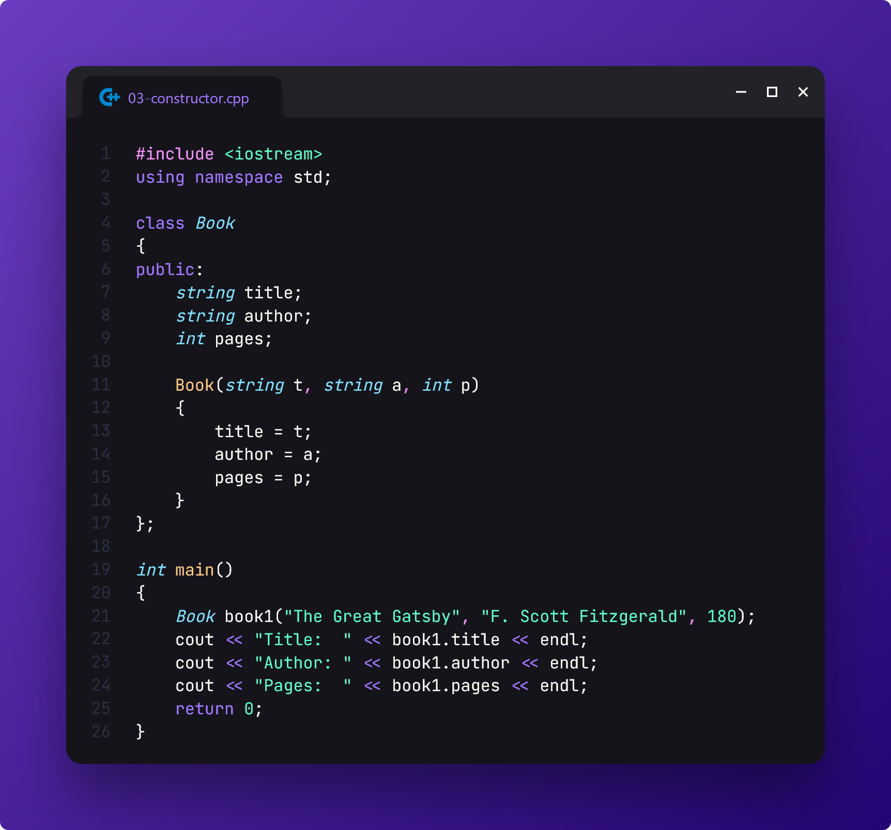
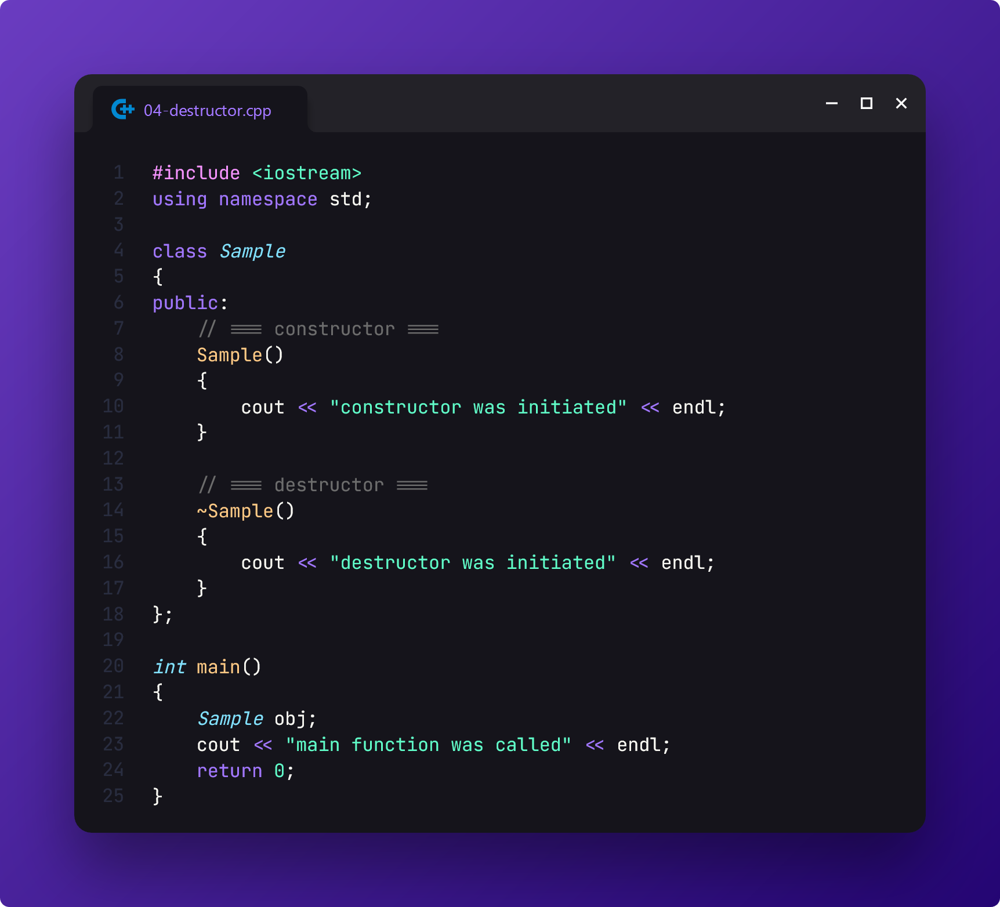
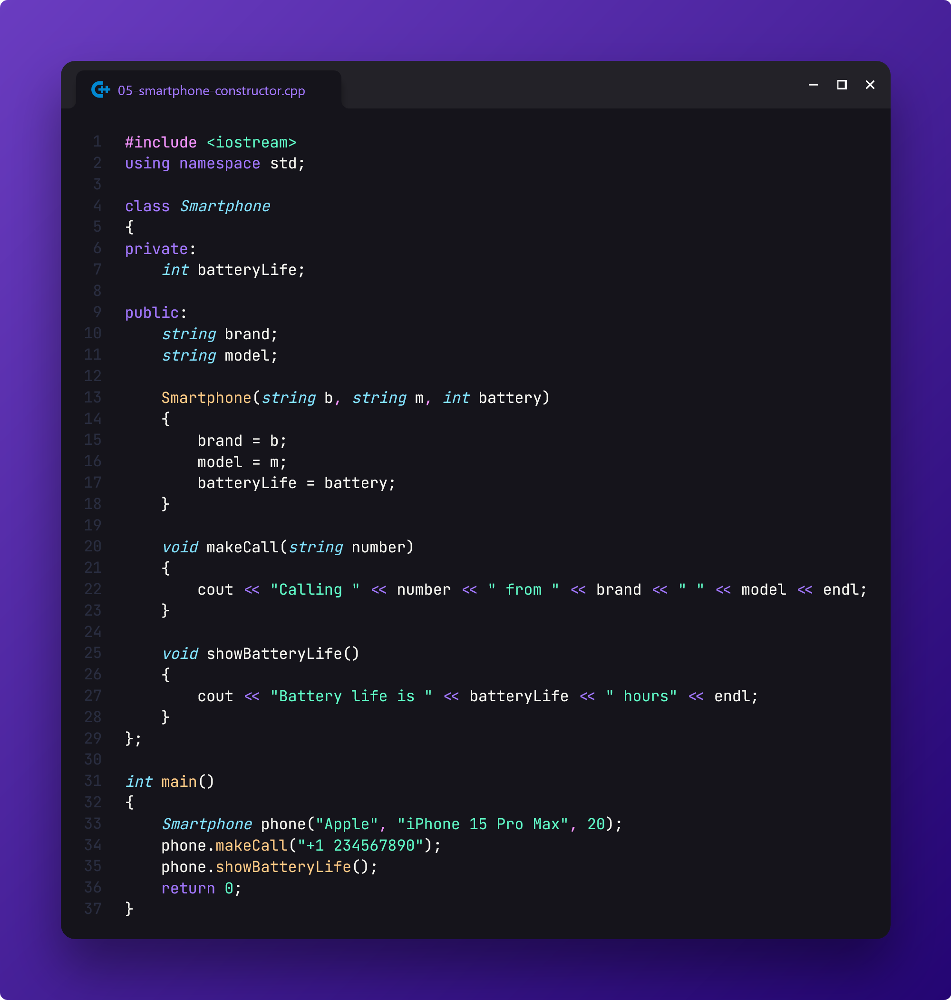
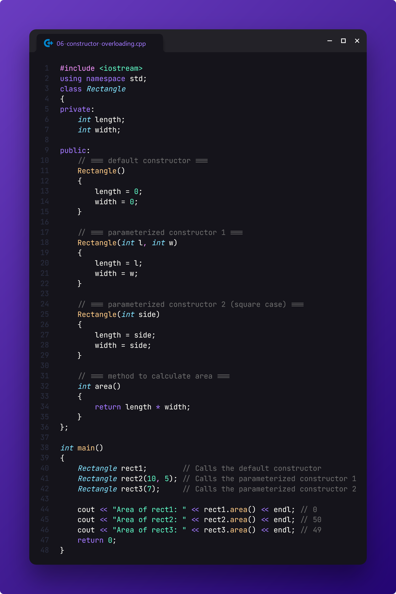
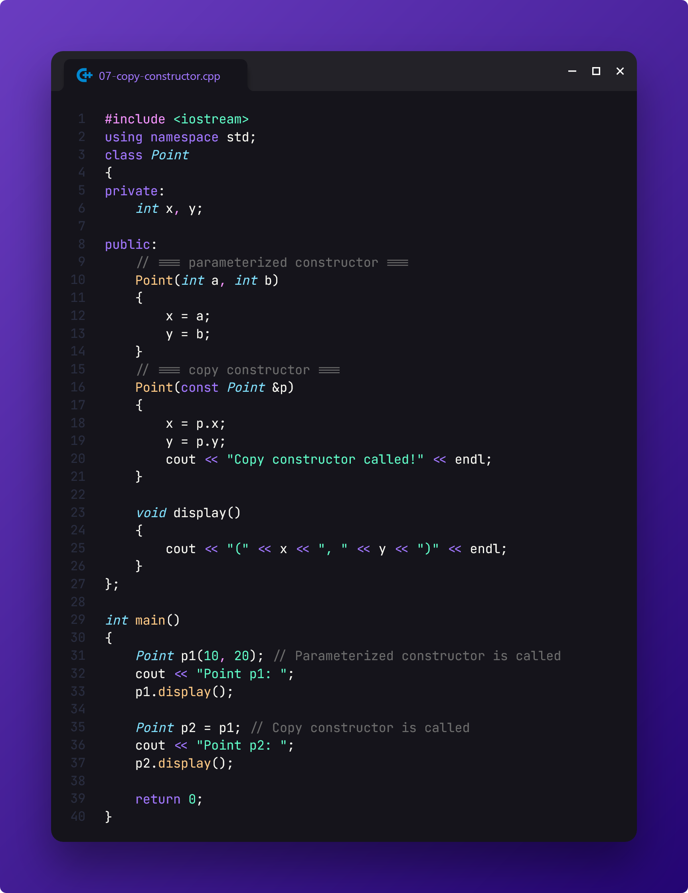

# Practice 4: Back to Basics

> This folder contains the practice problems assigned by our CSE lecturer, **NAB** on **September 7, 2024**.

[📄 **Question Paper**](./tasks.pdf)

## Class and Object

## Access Modifiers

## Constructor

## Destructor

## Relatable Example: Smartphone

## Constructor Overloading

## Copy Constructor

