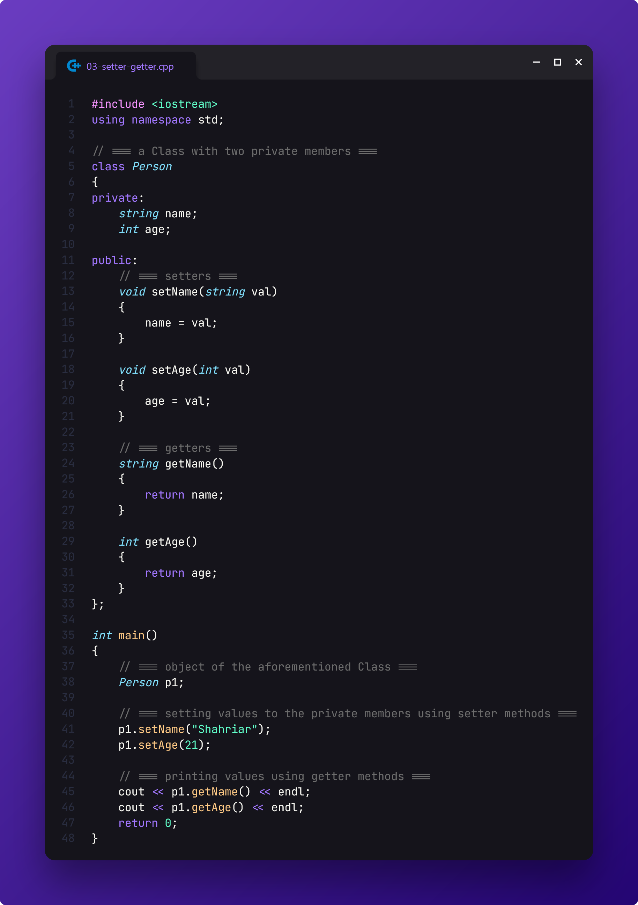

# Practice 5: Lab Assessment

> This is my submission for the solutions to the CSE **Online Lab Assessment** assigned on **September 7, 2024** by our CSE lecturer, **NAB**.

[📄 **Question Paper**](./tasks.pdf)

[🔗 **Classroom Submission**](https://classroom.google.com/c/NzExMDM1ODEyOTg0/a/NzA1Njg0OTIxNzA0/details)

## Task 1: Basic Function Creation

-   Write a simple `void` function named `greet` that prints **"Hello, World!"**

-   Create another function named `add` that takes two `int` parameters and returns their sum

## Task 2: Create a Simple Class

-   Define a class named `Person` with two public members: **name** (`string`) and **age** (`int`)

-   In the `main` function, create an object of the `Person` class and set the `name` and `age` values directly. Print these values

## Task 3: Use Getters and Setters

-   Change the `name` and `age` members of the `Person` class to **private**

-   Add public setter and getter methods (`setName`, `getName`, `setAge`, `getAge`) to set and access the **private** members

-   Update the `main` function to use these setters and getters to set and get the values of `name` and `age`

## Task 4: Add a Default Constructor

-   Add a default constructor to the `Person` class that initializes `name` to **"Unknown"** and `age` to **0**

-   In the main function, create an object of `Person` using the default constructor and print the default values

## Task 5: Add a Parameterized Constructor

-   Add a parameterized constructor to the `Person` class that accepts `name` and `age` as arguments and initializes the members

-   In the `main` function, create another object of `Person` using the parameterized constructor and print the values

## Task 6: Add Methods to the Class

-   Add a method named `introduce` in the `Person` class that prints a message like:

        Hello, my name is ${name}, and I am ${age} years old.

-   Call this method from the `main` function for the `Person` object

## Task 7: Use Object Pointers

-   Create a pointer to a `Person` object in the `main` function and use it to set and access the `Person` members and methods

## Task 8: Passing Objects to Functions

-   Write a function named `displayPersonInfo` that takes a `Person` object as a parameter and prints their information

-   Call this function from `main` using the `Person` object.

## Task 9: Create a Copy Constructor

-   Add a copy constructor to the `Person` class to initialize a new object using an existing object

-   In the `main` function, create a new `Person` object by copying an existing object and display its values

## Task 10: Return an Object

-   Create a global function with parameters than returns an object

